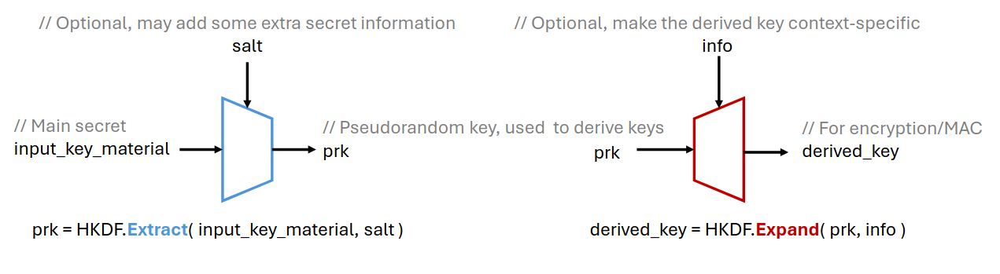

# Cryptography Engineering

This repository contains code for the course "Cryptography Engineering" at the University of Kassel in the winter semester 2024/2025.

## Lecture 1

### Tasks
1. Find some useful cryptographic libraries (Python: PyNaCl, ecdsa, cryptography, PyCryptodomem, etc.), Google (Bing/ChatGPT/...) them and figure out how to install them!
2. Given the example code of DHKE, implement the hashed ElGamal encryption

This has been implemented in [`crypto/hashed_elgamal.py`](crypto/hashed_elgamal.py).

### Homework

- Consider implementing DHKE to enable two programs on your PC to perform a key exchange (using sockets, etc.)
   1. Program Alice <-- (connection) --> Program Bob
   2. Program Alice -- g^x --> Program Bob
   3. Program Alice <-- g^y -- Program Bob

This has been implemented in [`homework1/lecture1/sockets/socket_user.py`](homework1/lecture1/sockets/socket_user.py).
Use the following commands to run the program:
```bash
python3 socket_user.py Alice 12345 54321
python3 socket_user.py Bob 54321 12345
```

- Add a trusted server to help the key exchange procedure (using sockets, etc.)
   1. Program Alice <-- (connection) --> Server <-- (connection) --> Program Bob
   2. Program Alice -- g^x --> Server -- g^x --> Program Bob
   3. Program Alice <-- g^y -- Server <-- g^y -- Program Bob

This has been added to [`homework1/lecture1/server/`](homework1/lecture1/server).
For more information see the [README](homework1/lecture1/server/README.md).

### Lecture 2

#### Tasks

1. Export a certificate from a website, and then use the example code ReadCert.py to read the certificate.
2. Find and export a pre-installed certificate on your laptop or PC (via browser), and use the example code to read the certificate.

This can be done using [`crypto/ReadCert.py`](crypto/ReadCert.py).

#### Homework

- Implement a man-in-the-middle attack (in one program) on DHKE.

This has been implemented in [`homework1/lecture2/mitm_attack/dhke_mitm.py`](homework1/lecture2/mitm_attack/dhke_mitm.py).

- Use the example code ‘ECDSA.py’ to demonstrate the nonce-reuse attack on ECDSA (i.e., recover the secret key given two valid signatures using the same randomness)

This has been added to [`homework1/lecture2/ECDSA.py`](homework1/lecture2/ECDSA.py).

- Bonus: Implement a man-in-the-middle attack on DHKE using sockets.

This has been implemented in [`homework1/lecture2/mitm_attack/sockets`](homework1/lecture2/mitm_attack/sockets).
For more information see the [README](homework1/lecture2/mitm_attack/sockets/README.md).

- Bonus: Use a trusted server and signatures to securely exchange public keys (using sockets): See next slide.
   1. Alice and Bob each have the server’s public key pre-installed, which they will use to verify the server's digital signatures.
   2. To initiate the key exchange, Alice first requests the server to generate a digital signature for her public key.
   3. After receiving the signed public key from the server, Alice sends her public key and the server’s signature to Bob.
   4. Bob, upon receiving (pk_alice, signature of pk_alice), verifies the signature with the server’s public key. If the signature is valid, Bob accepts pk_alice. Next, Bob requests a signature for his own public key from the server, following a similar process as Alice.
   5. Finally, Bob sends (pk_bob, signature of pk_bob) to Alice. Alice verifies the signature using the server’s public key and, if valid, accepts pk_bob.

TODO

### Lecture 3

#### Tasks
1. Run the example code “HKDF.py”. Play with it and learn how to derive keys from a secret.


#### Homework
- Implement the tweaked TLS handshake protocol (in the Client-Server setting using sockets)
  - Use the simplified key schedule algorithm:
  - 
  - 
  - 

This has been implemented in [`homework2/lecture3/tls`](homework2/lecture3/tls).

- Bonus: Implement the same protocol, but this time use SHA3-512 as the hash function (for HKDF, HMAC, and the key schedule) and P-521 as the elliptic curve for key exchange. This should allow you to derive a key with 512 bits (64 bytes).

### Lecture 4

#### Tasks

1. Implement a KDF chain based on HKDF.
- You can learn how to use HKDF in the example code “HKDF.py” of Lecture 3.
- To split a KDF output into Encryption Key and Chain Key, you can first specify the “length” parameter of hkdf_expand, and then truncate it into two byte-strings.

TODO

#### Homework

- Try implementing X3DH using sockets.
1. Suppose that Alice and Bob have registered with the server. Namely, the server has stored prekey
     bundles of Alice and Bob.
2. Alice wants to communicate with Bob, it first fetches prekey bundle of Bob from the server.
3. Upon receiving the prekey bundle of Bob, Alice verifies the bundle. If it is valid, then Alice follows the X3DH protocol and compute a shared key. After computing a shared key, it sends the protocol message (see the X3DH protocol in this lecture note) to the server.
4. The server forwards the message from Alice to Bob.
5. Upon receiving the message from Alice, Bob also compute the X3DH session key.

This has been implemented in [`homework2/lecture4/`](homework2/lecture4/). 

- Bonus: Upgrade your implementation of X3DH so that it allows the recipient user to be offline.

TODO

### Lecture 7

#### Tasks

- Perform offline dictionary attacks. Suppose I leaked a SHA3-256 hash of my password (i.e., hash_pw = SHA3-256([my password]) ) and the password is in a dictionary (in the example code). The hexadecimal value (lower case) of the hash_pw is: e8acff88511d7f8e48f038001c24d7b1ab76d9233d7894fa936c4c7c93d2c917
- Try to recover my password.

#### Homework

- Design a password-based login protocol and try analyzing it.
  - You should specify (1) How the server stores passwords (2) The message flow of the protocol (3) How the server verifies.
  - Analyze the security of your protocol (e.g., can it resist offline dictionary attacks?)
  - Hint: You may add some nonces in your protocol
- Implement your login system using sockets.
  - The “password database” of the server couble be a text file where each row is ([User_name], [Password/Hash_of_password/salted_hash_of_password])

This has been implemented in [`homework2/lecture7/auth`](homework2/lecture7/auth). More information can be found in the [README](homework2/lecture7/auth/README.md).